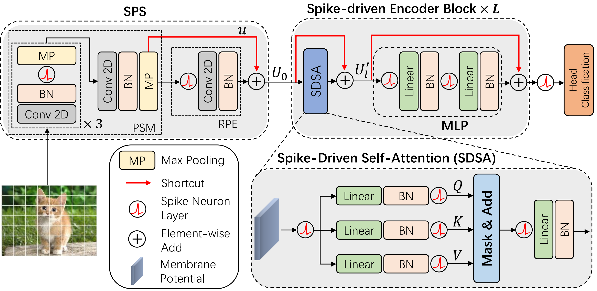
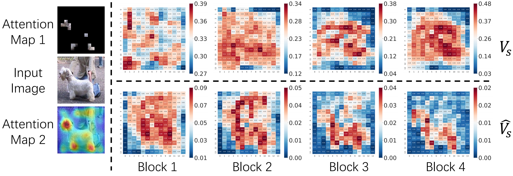

# Spike-Driven Transformer ([NeurIPS2023](https://openreview.net/forum?id=9FmolyOHi5))

[Man Yao](https://scholar.google.com/citations?user=eE4vvp0AAAAJ), [Jiakui Hu](https://github.com/jkhu29), [Zhaokun Zhou](https://github.com/ZK-Zhou), [Li Yuan](https://yuanli2333.github.io/), [Yonghong Tian](https://scholar.google.com/citations?user=fn6hJx0AAAAJ), [Bo Xu](), [Guoqi Li](https://scholar.google.com/citations?user=qCfE--MAAAAJ&)

BICLab, Institute of Automation, Chinese Academy of Sciences

---

:rocket:  :rocket:  :rocket: **News**:

- **Jul. 04, 2023**: Release the code for training and testing.
- **Sep. 22, 2023**: Accepted as poster in NeurIPS2023.
- **Sep. 30, 2023**: Release the configs and pre-trained parameters on IN1K.
- **Feb. 15. 2024**: The [Spike-Driven Transformer V2](https://github.com/BICLab/Spike-Driven-Transformer-V2), which achieves 80.0% acc on IN1K, is now available.

## Abstract

Spiking Neural Networks (SNNs) provide an energy-efficient deep learning option due to their unique spike-based event-driven (i.e., spike-driven) paradigm. In this paper, we incorporate the spike-driven paradigm into Transformer by the proposed Spike-driven Transformer with four unique properties: i) **Event-driven**, no calculation is triggered when the input of Transformer is zero; ii) **Binary spike communication**, all matrix multiplications associated with the spike matrix can be transformed into sparse additions; iii) **Self-attention with linear complexity at both token and channel dimensions**; iv) The operations between spike-form Query, Key, and Value are mask and addition. Together, **there are only sparse addition operations** in the Spike-driven Transformer. To this end, we design a novel Spike-Driven Self-Attention (SDSA), which exploits only mask and addition operations without any multiplication, and thus having up to **87.2× lower** computation energy than vanilla self-attention. Especially in SDSA, the matrix multiplication between Query, Key, and Value is designed as the mask operation. In addition, we rearrange all residual connections in the vanilla Transformer before the activation functions to ensure that all neurons transmit binary spike signals. It is shown that the Spike-driven Transformer can achieve **77.1% top-1** accuracy on ImageNet-1K, which is the state-of-the-art result in the SNN field.


## Requirements

```python3
timm == 0.6.12
1.10.0 <= pytorch < 2.0.0
cupy
spikingjelly == 0.0.0.0.12
```

## Results on Imagenet-1K

|        **model**         | **T** | **layers** | **channels** | **Top-1 Acc** | **Power(mj)** | **Models** |
| :----------------------: | :---: | :--------: | :----------: | :-----------: | :-----------: | :--------: |
| Spike-Driven Transformer |   4   |     8      |     384      |   **72.28**   |   **3.90**    |    [link](https://drive.google.com/file/d/10oH_zkwB4FDtFLgmZ_lI8e0tFjRzrXyD/view?usp=sharing)    |
| Spike-Driven Transformer |   4   |     6      |     512      |   **74.11**   |   **3.56**    |    [link](https://drive.google.com/file/d/1hsShpFBKYpMK2TmpuoyBFORcLAuMHrx7/view?usp=sharing)    |
| Spike-Driven Transformer |   4   |     8      |     512      |   **74.57**   |   **4.50**    |    [link](https://drive.google.com/file/d/1n59WNSBgP2VyAW2nfJX2Wvx5rgNJEMXI/view?usp=sharing)    |
| Spike-Driven Transformer |   4   |     10     |     512      |   **74.66**   |   **5.53**    |    [link](https://drive.google.com/file/d/1l-c3QY5r4IFmYUmGPZXRHP_W7iC1sdP8/view?usp=sharing)    |
| Spike-Driven Transformer |   4   |     8      |     768      |   **77.07**   |   **6.09**    |    [link](https://drive.google.com/file/d/1R-MaeFV8d2Y0pIGBSjklOGWhaF8dLHf4/view?usp=sharing)    |

## Train & Test



The hyper-parameters are in `./conf/`.


Train:

```shell
CUDA_VISIBLE_DEVICES=0 python -m torch.distributed.launch --nproc_per_node=1 --master_port 29501 train.py -c /the/path/of/conf --model sdt --spike-mode lif
```

Test:

```shell
CUDA_VISIBLE_DEVICES=0 python -m torch.distributed.launch --nproc_per_node=1 --master_port 29501 firing_num.py -c /the/path/of/conf --model sdt --spike-mode lif --resume /the/path/of/parameters --no-resume-opt

# for 288 x 288 resolution
CUDA_VISIBLE_DEVICES=0 python -m torch.distributed.launch --nproc_per_node=1 --master_port 29501 firing_num.py -c /the/path/of/conf --model sdt --spike-mode lif --resume /the/path/of/parameters --no-resume-opt --large-valid
```

Result and explainability:



## Data Prepare

- use `PyTorch` to load the CIFAR10 and CIFAR100 dataset.
- use `SpikingJelly` to prepare and load the Gesture and CIFAR10-DVS dataset.

Tree in `./data/`.

```shell
.
├── cifar-100-python
├── cifar-10-batches-py
├── cifar10-dvs
│   ├── download
│   ├── events_np
│   ├── extract
│   ├── frames_number_10_split_by_number
│   └── frames_number_16_split_by_number
├── cifar10-dvs-tet
│   ├── test
│   └── train
└── DVSGesturedataset
    ├── download
    ├── events_np
    │   ├── test
    │   └── train
    ├── extract
    │   └── DvsGesture
    ├── frames_number_10_split_by_number
    │   ├── download
    │   ├── test
    │   └── train
    └── frames_number_16_split_by_number
        ├── test
        └── train
```

ImageNet with the following folder structure, you can extract imagenet by this [script](https://gist.github.com/BIGBALLON/8a71d225eff18d88e469e6ea9b39cef4).

```shell
│imagenet/
├──train/
│  ├── n01440764
│  │   ├── n01440764_10026.JPEG
│  │   ├── n01440764_10027.JPEG
│  │   ├── ......
│  ├── ......
├──val/
│  ├── n01440764
│  │   ├── ILSVRC2012_val_00000293.JPEG
│  │   ├── ILSVRC2012_val_00002138.JPEG
│  │   ├── ......
│  ├── ......
```

## Contact Information

```
@inproceedings{yao2023spikedriven,
title={Spike-driven Transformer},
author={Man Yao and JiaKui Hu and Zhaokun Zhou and Li Yuan and Yonghong Tian and Bo XU and Guoqi Li},
booktitle={Thirty-seventh Conference on Neural Information Processing Systems},
year={2023},
url={https://openreview.net/forum?id=9FmolyOHi5}
}
```

For help or issues using this git, please submit a GitHub issue.

For other communications related to this git, please contact `manyao@ia.ac.cn` and `jkhu29@stu.pku.edu.cn`.
